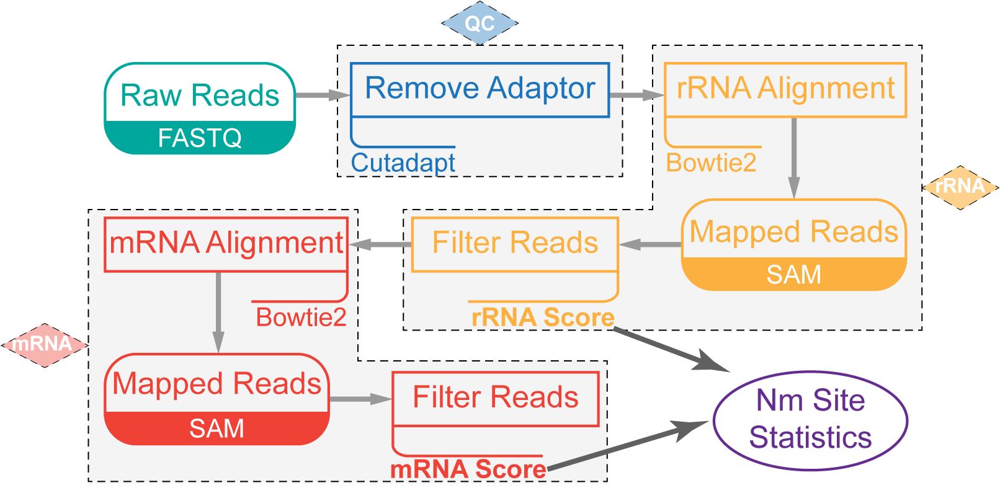

# NJU-seq

**N**m site **J**udged **U**niversally **seq**uencing.  
A brand-new version of MgR-seq.  
From clean data to positions with 2-*O*-methylation.



## 1. Preparation

#### Install packages and software.

Software managed by [brew](https://brew.sh/).

```shell script
# generic tools
brew install parallel pigz

# bioinformatics tools
brew install bowtie2
brew install picard-tools samtools
```

Perl packages:

```shell script
cpanm YAML::Syck AlignDB::IntSpan PerlIO::gzip Algorithm::Combinatorics
```

*To install PerlIO::gzip on [WSL2](https://devblogs.microsoft.com/commandline/announcing-wsl-2/), you might need to
install [`zlib.h`](http://www.zlib.net/) manually.*

R packages needed:
`ggplot2` `ggpubr` `gridExtra` `forcats` `dplyr` `VennDiagram` `splines` `RColorBrewer` `extrafont` `reshape2`

Make new folders for analysis.

```shell script
# NJU_seq_analysis is the main directory of the following analysis. It can be renamed as you like.
mkdir "NJU_seq_analysis"
cd "NJU_seq_analysis" || exit
git clone https://github.com/IvanWoo22/NJU_seq.git
mkdir "data" "index" "temp" "output"
```

## 2. Reference and index.

#### Download reference.

Get reference sequence of species from [GENCODE](https://www.gencodegenes.org/)
and [Ensembl](http://plants.ensembl.org/Arabidopsis_thaliana/Info/Index?db=core).

```shell script
# GENCODE release 34 for human
wget -N ftp://ftp.ebi.ac.uk/pub/databases/gencode/Gencode_human/release_34/gencode.v34.annotation.gff3.gz -O data/hsa.gff3.gz
wget -N ftp://ftp.ebi.ac.uk/pub/databases/gencode/Gencode_human/release_34/gencode.v34.transcripts.fa.gz -O data/hsa_transcript.fa.gz

# GENCODE release M25 for mouse
wget -N ftp://ftp.ebi.ac.uk/pub/databases/gencode/Gencode_mouse/release_M25/gencode.vM25.annotation.gff3.gz -O data/mmu.gff3.gz
wget -N ftp://ftp.ebi.ac.uk/pub/databases/gencode/Gencode_mouse/release_M25/gencode.vM25.transcripts.fa.gz -O data/mmu_transcript.fa.gz

# Ensembl release 46 for Arabidopsis thaliana
wget -N ftp://ftp.ensemblgenomes.org/pub/plants/release-46/fasta/arabidopsis_thaliana/dna/Arabidopsis_thaliana.TAIR10.dna.toplevel.fa.gz -O data/ath_dna.fa.gz
wget -N ftp://ftp.ensemblgenomes.org/pub/plants/release-46/gff3/arabidopsis_thaliana/Arabidopsis_thaliana.TAIR10.46.gff3.gz -O data/ath.gff3.gz
wget -N ftp://ftp.ensemblgenomes.org/pub/plants/release-46/fasta/arabidopsis_thaliana/cdna/Arabidopsis_thaliana.TAIR10.cdna.all.fa.gz -O data/ath_transcript.fa.gz
wget -N ftp://ftp.ensemblgenomes.org/pub/plants/release-46/fasta/arabidopsis_thaliana/ncrna/Arabidopsis_thaliana.TAIR10.ncrna.fa.gz -O data/ath_ncrna.fa.gz

# miRBase latest release for miRNA
wget -N ftp://mirbase.org/pub/mirbase/CURRENT/mature.fa.gz -O data/mirna.fa.gz
```

#### Build index

Create index by `bowtie2-build` for mapping.

```shell script
THREAD=16

# rRNA index
# 5.8s,18s and 28s rRNA.
cat NJU_seq/data/hsa_rrna/* >data/hsa_rrna.fa
bowtie2-build data/hsa_rrna.fa index/hsa_rrna
rm data/hsa_rrna.fa

# mRNA index
# Only protein_coding transcripts will be extract to build index.
pigz -dc data/hsa_transcript.fa.gz |
  perl NJU_seq/tool/fetch_fasta.pl \
  --stdin -s 'transcript_biotype:protein_coding' \
  >data/hsa_protein_coding.fa

bowtie2-build --threads "${THREAD}" \
  data/hsa_protein_coding.fa index/hsa_protein_coding
rm data/hsa_protein_coding.fa
```

## 3. Data Selection and quality overview.

#### Select data for analysing.

Get the sequencing clean data from `NJU_data`.  
*The representation of `ID` can be found in [`sample_list.csv`](/sample_list.csv).*

```shell script
ID='NJU6148'
PREFIX='HeLa_RF_NC'

mkdir -p "data/${PREFIX}" "temp/${PREFIX}" "output/${PREFIX}"
ln -sf /home/wyf/NJU_data/"${ID}"/R1.fq.gz data/"${PREFIX}"/R1.fq.gz
ln -sf /home/wyf/NJU_data/"${ID}"/R2.fq.gz data/"${PREFIX}"/R2.fq.gz
```

*Better to process the other samples in the same group according to the above code box. Here NJU6148-6151 are in one
group as `HeLa_RF_NC` `HeLa_RF_1` `HeLa_RF_2` `HeLa_RF_3`.*

#### Quality control for clean data.

Input a `FastQ` file or a `GZ` file of `FastQ`, and then get some quality information.

```shell script
PREFIX='HeLa_RF_NC'

# For pair-end sequence data, we firstly turn them to single-end file.
perl NJU_seq/quality_control/pe_consistency.pl \
  data/"${PREFIX}"/R1.fq.gz data/"${PREFIX}"/R2.fq.gz \
  temp/"${PREFIX}".fq.gz
# Total:  12627217
# Consistency:  12450207
# Proportion: 98.60%

# PREFIX do as HeLa_RF_NC HeLa_RF_1 HeLa_RF_2 HeLa_RF_3.

# Quality control
time perl NJU_seq/quality_control/fastq_qc.pl \
  temp/HeLa_RF_NC.fq.gz \
  temp/HeLa_RF_1.fq.gz \
  temp/HeLa_RF_2.fq.gz \
  temp/HeLa_RF_3.fq.gz \
  output \
  HeLa_RF
# real  3m28.250s
# user  3m26.499s
# sys   0m0.495s

# $ARGV[-2] should be the directory of output files.
# $ARGV[-1] should be the prefix of the output files.
```

*The quality report created in `/output/HeLa_RF.pdf`.*

## 4. Alignment, Count and Score

#### rRNA workflow

Use `bowtie2` to align the data file.

```shell script
THREAD=16
PREFIX='HeLa_RF_NC'

time bowtie2 -p "${THREAD}" -a -t \
  --end-to-end -D 20 -R 3 \
  -N 0 -L 10 -i S,1,0.50 --np 0 \
  --xeq -x index/hsa_rrna \
  -1 data/"${PREFIX}"/R1.fq.gz -2 data/"${PREFIX}"/R2.fq.gz \
  -S output/"${PREFIX}"/rrna.raw.sam \
  2>&1 |
  tee output/"${PREFIX}"/rrna.bowtie2.log
# real  1m53.474s
# user  25m41.846s
# sys   4m15.462s

perl NJU_seq/tool/stat_alignment.pl \
  output/"${PREFIX}"/rrna.bowtie2.log |
  Rscript NJU_seq/tool/draw_table.R \
  output/"${PREFIX}"/rrna.bowtie2.pdf

time pigz -p "${THREAD}" output/"${PREFIX}"/rrna.raw.sam
# real  0m57.962s
# user  3m54.868s
# sys   0m7.795s
```

Filter and count alignment result.

```shell script
THREAD=16
PREFIX='HeLa_RF_NC'

time pigz -dcf output/"${PREFIX}"/rrna.raw.sam.gz |
  parallel --pipe --block 10M --no-run-if-empty --linebuffer --keep-order -j "${THREAD}" '
    awk '\''$6!="*"&&$7=="="{print $1 "\t" $3 "\t" $4 "\t" $6 "\t" $10}
    '\'' |
    perl NJU_seq/rrna_analysis/matchquality_judge.pl |
    perl NJU_seq/rrna_analysis/multimatch_judge.pl
  ' \
  >temp/"${PREFIX}"/rrna.out.tmp
# real  1m59.185s
# user  20m44.643s
# sys   1m24.060s

time parallel -j 3 "
  perl NJU_seq/rrna_analysis/readend_count.pl \\
    NJU_seq/data/hsa_rrna/{}.fa temp/${PREFIX}/rrna.out.tmp {} \\
    >output/${PREFIX}/rrna_{}.tsv
  " ::: 28s 18s 5-8s
# real  0m27.994s
# user  0m59.369s
# sys   0m0.809s
```

Score all sites one by one.

```shell script
time parallel -j 3 "
  perl NJU_seq/rrna_analysis/score.pl \\
    output/HeLa_RF_NC/rrna_{}.tsv \\
    output/HeLa_RF_1/rrna_{}.tsv \\
    output/HeLa_RF_2/rrna_{}.tsv \\
    output/HeLa_RF_3/rrna_{}.tsv \\
      >output/HeLa_RF_rrna_{}_scored.tsv
  " ::: 28s 18s 5-8s
# real  0m0.459s
# user  0m0.661s
# sys   0m0.048s

bash NJU_seq/presentation/point_venn.sh \
  Sample1 output/HeLa_RF_rrna_18s_scored.tsv 14\
  Sample2 output/HeLa_RF_rrna_18s_scored.tsv 15\
  Sample3 output/HeLa_RF_rrna_18s_scored.tsv 16\
  output/HeLa_RF_rrna_venn.png 40
```

#### Prepare for mRNA.

Extract reads can't be mapped to rRNA.

```shell script
PREFIX='HeLa_RF_NC'

time bash NJU_seq/tool/extract_fastq.sh \
  temp/"${PREFIX}"/rrna.out.tmp \
  data/"${PREFIX}"/R1.fq.gz data/"${PREFIX}"/R1.mrna.fq.gz \
  data/"${PREFIX}"/R2.fq.gz data/"${PREFIX}"/R2.mrna.fq.gz
# real  1m10.382s
# user  1m45.610s
# sys   0m3.268s
```

#### mRNA workflow

Alignment with protein_coding transcript.

```shell script
THREAD=16
PREFIX='HeLa_RF_NC'

time bowtie2 -p "${THREAD}" -a -t \
  --end-to-end -D 20 -R 3 \
  -N 0 -L 10 --score-min C,0,0 \
  --xeq -x index/hsa_protein_coding \
  -1 data/"${PREFIX}"/R1.mrna.fq.gz -2 data/"${PREFIX}"/R2.mrna.fq.gz \
  -S output/"${PREFIX}"/mrna.raw.sam \
  2>&1 |
  tee output/"${PREFIX}"/mrna.bowtie2.log
# real  6m43.243s
# user  119m34.749s
# sys   8m1.470s

time pigz -p "${THREAD}" output/"${PREFIX}"/mrna.raw.sam
# real  0m22.663s
# user  5m38.943s
# sys   0m9.316s
```

Filter，re-locate and count alignment result.

```shell script
THREAD=16
PREFIX='HeLa_RF_NC'

time gzip -dcf output/"${PREFIX}"/mrna.raw.sam.gz |
  parallel --pipe --block 100M --no-run-if-empty --linebuffer --keep-order -j "${THREAD}" '
    awk '\''$6!="*"&&$7=="="{print $1 "\t" $3 "\t" $4 "\t" $6 "\t" $10}
    '\'' |
    perl NJU_seq/mrna_analysis/multimatch_judge.pl
  ' | perl NJU_seq/mrna_analysis/multimatch_judge.pl \
  >temp/"${PREFIX}"/mrna.out.tmp
# real  2m31.558s
# user  18m38.617s
# sys   2m8.716s

gzip -dcf data/hsa.gff3.gz |
  awk '$3=="exon" {print $1 "\t" $4 "\t" $5 "\t" $7 "\t" $9}' \
  >data/hsa_exon.info

cat temp/"${PREFIX}"/mrna.out.tmp |
  parallel --pipe --block 100M --no-run-if-empty --linebuffer --keep-order -j "${THREAD}" '
    perl NJU_seq/mrna_analysis/dedup.pl \
      --refstr "Parent=transcript:" \
      --transid "ENST" \
      --info data/hsa_exon.info
  ' |
  perl NJU_seq/mrna_analysis/dedup.pl \
    --refstr "Parent=transcript:" \
    --transid "ENST" \
    --info data/hsa_exon.info \
    >temp/"${PREFIX}"/mrna.dedup.tmp
# real  14m32.692s
# user  14m22.635s
# sys   0m10.268s

time bash NJU_seq/mrna_analysis/almostunique.sh \
  temp/"${PREFIX}"/mrna.dedup.tmp \
  data/"${PREFIX}"/R1.mrna.fq.gz \
  temp/"${PREFIX}" \
  temp/"${PREFIX}"/mrna.almostunique.tmp
# real  2m52.775s
# user  2m41.319s
# sys   0m4.881s

time perl NJU_seq/mrna_analysis/count.pl \
  temp/"${PREFIX}"/mrna.almostunique.tmp \
  >temp/"${PREFIX}"/mrna.count.tmp
# real  0m3.072s
# user  0m3.036s
# sys   0m0.036s

time gzip -dcf data/hsa.gff3.gz |
  awk '$3=="exon" {print $1 "\t" $4 "\t" $5 "\t" $7 "\t" $9}' |
  perl NJU_seq/mrna_analysis/merge.pl \
    --refstr "Parent=transcript:" \
    --geneid "ENSG" \
    --transid "ENST" \
    -i temp/"${PREFIX}"/mrna.count.tmp \
    -o output/"${PREFIX}"/mrna.tsv
# real  0m6.802s
# user  0m9.653s
# sys   0m0.227s
```

Calculate valid sequencing depth (average coverage).

```shell script
parallel --keep-order -j 4 '
  echo {} >>output/{}/mrna.cov
  bash NJU_seq/presentation/seq_depth.sh \
    temp/{}/mrna.almostunique.tmp \
    output/{}/mrna.tsv \
    >>output/{}/mrna.cov
  ' ::: HeLa_RF_NC HeLa_RF_1 HeLa_RF_2 HeLa_RF_3
# All stop times: 319414
# All positions:  18550
# Coverage:       17.21

# All stop times: 338093
# All positions:  20686
# Coverage:       16.34

# All stop times: 319682
# All positions:  37777
# Coverage:       8.46

# All stop times: 356951
# All positions:  19098
# Coverage:       18.69
```

Score each covered site.

```shell script
parallel -j 3 "
  perl NJU_seq/mrna_analysis/score.pl \\
    output/HeLa_RF_NC/mrna.tsv \\
    output/{}/mrna.tsv |
      sort -t $'\t' -nrk 12,12 \\
        >output/{}_mrna_scored.tsv
  " ::: HeLa_RF_1 HeLa_RF_2 HeLa_RF_3

for TOP in 50 100 1000 3000 5000; do
  awk -v a=`head -${TOP} output/HeLa_RF_1_mrna_scored.tsv | tail -1 | awk '{print $12}'` \
    '$12>=a {print $1 $3 $2}' output/HeLa_RF_1_mrna_scored.tsv \
    >temp/sample1.txt
  awk -v a=`head -${TOP} output/HeLa_RF_2_mrna_scored.tsv | tail -1 | awk '{print $12}'` \
    '$12>=a {print $1 $3 $2}' output/HeLa_RF_2_mrna_scored.tsv \
    >temp/sample2.txt
  awk -v a=`head -${TOP} output/HeLa_RF_3_mrna_scored.tsv | tail -1 | awk '{print $12}'` \
    '$12>=a {print $1 $3 $2}' output/HeLa_RF_3_mrna_scored.tsv \
    >temp/sample3.txt
  Rscript NJU_seq/presentation/point_venn.R \
    Sample1 temp/sample1.txt \
    Sample2 temp/sample2.txt \
    Sample3 temp/sample3.txt \
    output/HeLa_RF_mrna_top${TOP}_venn.png
  rm temp/sample1.txt temp/sample2.txt temp/sample3.txt output/HeLa_RF_mrna_top${TOP}_venn.png*.log
done

# perl NJU_seq/tool/common.pl \
#  output/HeLa_RF_1_mrna_scored.tsv \
#  output/HeLa_RF_2_mrna_scored.tsv \
#  output/HeLa_RF_3_mrna_scored.tsv \
#  >output/HeLa_RF_mrna_scored.tsv

perl NJU_seq/mrna_analysis/extract_point.pl \
  output/HeLa_RF_1_mrna_scored.tsv \
  output/HeLa_RF_2_mrna_scored.tsv \
  output/HeLa_RF_3_mrna_scored.tsv \
  1000 1 >output/HeLa_RF_mrna_scored_1000p.tsv

#pigz -dc data/hsa.gff3.gz |
#  awk '$3=="gene"' |
#  perl NJU_seq/tool/add_gene_name.pl \
#    --id "gene_id=" \
#    --name "gene_name=" \
#    --col "8" \
#    --file "output/${PREFIX}_mrna_scored_500p.tsv" \
#    >output/${PREFIX}_mrna_scored_500p_name.tsv
```

## 5. Statistics and Presentation.

See the signature of Nm sites.

```shell script
perl NJU_seq/presentation/signature_count.pl \
  output/HeLa_RF_mrna_scored_1000p.tsv \
  output/HeLa_RF_mrna_signature.pdf
```

GO(Gene Ontology) analysis for the top common 1000 Nm sites.

After submit and analysis using [DAVID](https://david.ncifcrf.gov/tools.jsp), commands below could turn the chart into
barplot.

```shell script
Rscript NJU_seq/presentation/gene_ontology.R \
  output/HeLa_RF_GO.tsv \
  output/HeLa_RF_GO.pdf
```

Divide annotations into two categories.

```shell script
pigz -dcf data/hsa.gff3.gz |
  awk '(($3=="gene")&&($9~/biotype=protein_coding/)) \
    || (($3=="mRNA")&&($9~/biotype=protein_coding/)) \
    || ($3=="exon")' |
  perl NJU_seq/mrna_analysis/filter_nonsenseexon.pl \
    --transwording "mRNA" \
    --transid "ID=transcript:" \
    --exonid "Parent=transcript:" |
  perl NJU_seq/mrna_analysis/filter_nonsensegene.pl |
  perl NJU_seq/mrna_analysis/filter_overlapgene.pl |
  perl NJU_seq/mrna_analysis/judge_altersplice.pl \
    --transwording "mRNA" \
    --geneid "ID=gene:" \
    --alter "data/hsa_alter_gene.yml" \
    --unique "data/hsa_unique_gene.yml"
    
#pigz -dc data/hsa.gff3.gz |
#  awk '(($3=="transcript")&&($9~/transcript_type=protein_coding/))' |
#  perl NJU_seq/mrna_analysis/representative_transcript.pl \
#    --geneid "gene_id=" \
#    --transid "transcript_id=" \
#    >data/hsa_represent_transcript.txt

#pigz -dc data/hsa.gff3.gz |
#	awk '(($3=="transcript")&&($9~/transcript_type=protein_coding/))' |
#	perl NJU_seq/mrna_analysis/main_transcript_1.pl \
#	--geneid "gene_id=" \
#	--transid "transcript_id=" \
#	>data/hsa_main_transcript.txt
```

Analyse the Nm points.

```shell script
#pigz -dc data/hsa.gff3.gz |
#  awk '(($3=="transcript")&&($9~/transcript_type=protein_coding/)) \
#    ||(($3=="exon")&&($9~/transcript_type=protein_coding/))' |
#  perl NJU_seq/mrna_analysis/judge_altersplice_1.pl \
#    --geneid "gene_id=" \
#    --transid "transcript_id=" \
#    --rep_trans "data/hsa_main_transcript.txt" \
#    >data/hsa_gene_spliceregion.yml

perl NJU_seq/mrna_analysis/stat_altersplice_1.pl \
  data/hsa_alter_gene.yml \
  <output/HeLa_RF_mrna_scored.tsv \
  >temp/HeLa_RF_altergene.tsv

perl NJU_seq/mrna_analysis/stat_altersplice_2.pl \
  <temp/HeLa_RF_altergene.tsv \
  >output/HeLa_RF_altergene_cov.tsv
# Output file is the final result.

pigz -dc data/hsa.gff3.gz |
  awk '(($3=="five_prime_UTR") || ($3=="three_prime_UTR") || ($3=="CDS"))' |
  perl NJU_seq/mrna_analysis/judge_transcriptregion_1.pl \
    --transid "Parent=transcript:" \
    --rep_trans "data/hsa_represent_transcript.txt" \
    >data/hsa_transcript_region.tsv
# The creation of data/hsa_transcript.txt is to be done.
    
perl NJU_seq/mrna_analysis/judge_transcriptregion_2.pl \
  data/hsa_transcript_region.tsv \
  <output/HeLa_RF_mrna_scored.tsv \
  >temp/HeLa_RF_transregion.tsv
  
perl NJU_seq/mrna_analysis/judge_transcriptregion_3.pl \
  <temp/HeLa_RF_transregion.tsv \
  >temp/HeLa_RF_transregion_cov.tsv
  
perl NJU_seq/mrna_analysis/judge_transcriptregion_4.pl \
  data/hsa_transcript_region.tsv \
  <output/HeLa_RF_mrna_scored.tsv \
  >output/HeLa_RF_mrna_scored_distribution.tsv
```

## 6. Motif Found in miRNA.

Get miRNA sequence information from ncRNA reference.

```shell script
pigz -dc data/mirna.fa.gz |
  perl NJU_seq/tool/fetch_fasta.pl \
    --stdin -s 'thaliana' |
  perl NJU_seq/mrna_analysis/motif_mirna.pl \
    >data/hsa_mirna_motif.tsv

perl NJU_seq/mrna_analysis/motif_nm.pl \
  data/hsa_dna.fa.gz \
  output/HeLa_RF_mrna_scored_sorted.tsv \
  >output/HeLa_RF_mrna_motif.tsv

perl NJU_seq/mrna_analysis/motif_compare.pl \
  data/hsa_mirna_motif.tsv \
  output/HeLa_RF_mrna_motif.tsv
```
